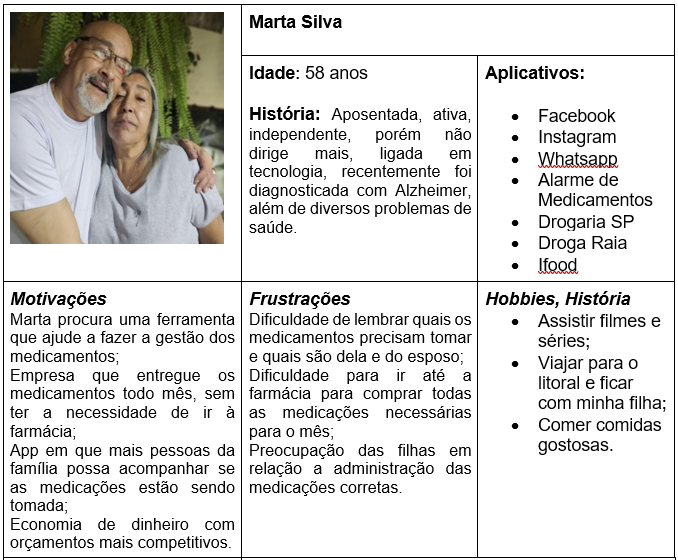

# Especificações do Projeto

A proposta é criar um aplicativo que ajude as pessoas que utilizam medicamentos rotineiros, a pagar o melhor valor pelo medicamento e o mesmo ser entregue em sua residência, antes de acabar, evitando a interrupção do tratamento, sem a necessidade de ficar nas filas da farmácia, os medicamentos virão separados por dose e horário de consumo, com a opção de o usuário receber os alarmes em seu smartphone avisando o horário da medicação. 

Para isso será utilizado o React Native para desenvolver o aplicativo no front e para banco de dados o Firebase.

## Personas

  
  
  
  
  

<h2> Juliana Rodrigues </h2>

|  |                                                                                                                    |
|-----------------------------------------------------------------------------------------------------------------------------------------------------------------------------------------------------------------------------------------------------------------------------------------------------------------------------------------------------------------------------------------------------------------------------------------------------------------|-------------------------------------------------------------------------------------------------------------------------------------|
| História: Estudante e estagiária, enfrenta diariamente uma rotina com prazos apertados e muitas atividades a serem desenvolvidas e agora também o desafio de cuidar de seus pais idosos, que têm múltiplas condições de saúde, assumindo a responsabilidade de administrar os medicamentos e consultas médicas de seus pais.   Juliana se sente sobrecarregada tentando equilibrar suas responsabilidades no trabalho, estudos e com o cuidado de seus pais. | Idade: 22 anos.                                                                                                                     |
| Motivações: Aliada à tecnologia Juliana procura uma ferramenta que ofereça lembretes precisos para os horários de administração de medicamentos, mas que também forneça informações sobre os remédios prescritos.  Além disso, Juliana tem como objetivo encontrar um aplicativo que ofereça a conveniência de entrega dos medicamentos diretamente em sua casa, eliminando a necessidade de deslocamentos extras à farmácia.                                   | Aplicativos:   - Instagram,    - WhatsApp,    - TikTok.                                                                    |
| Frustrações:    - Dificuldade em acompanhar os horários de medicamentos e consultas médicas de ambos os pais.    - Preocupação constante com a saúde e bem-estar deles.     - Desafio em manter um equilíbrio entre o trabalho, estudo, o cuidado dos pais e o próprio tempo.     - Falta de tempo para buscar medicamentos na farmácia.                                                                                                            | Hobbies, História:    - Criar memórias e experiência com a família.    - Fotografia.    - Exercício físico, ioga e dança.  |

  

## Histórias de Usuários

Com base na análise das personas forma identificadas as seguintes histórias de usuários:

|EU COMO... `PERSONA`| QUERO/PRECISO ... `FUNCIONALIDADE` |PARA ... `MOTIVO/VALOR`                 |
|--------------------|------------------------------------|----------------------------------------|
| Marina Alves    | Um canal confiável e programação de entregas regulares de medicamentos com base nos horários especificados | Reduzir o risco de esquecimento e melhorar a saúde                        |
| Juliana Rodrigues | Lembretes dos horários corretos para administração dos medicamentos | Garantir resposta eficaz ao tratamento proposto                            |
| Juliana Rodrigues | Receber todos os medicamentos em casa                               | Conquistar mais tempo para outras atividades                               |
| Samira Santana  | Receber medicamentos em casa separados por horário                  | Simplificar rotina e gerenciamento de doses                               |
| Marta Silva     | Receber medicamentos em casa com lembretes para tomar remédios     | Evitar interrupção no tratamento e receber lembretes                       |
| Larissa Gonçalves| Economia na compra e gestão dos medicamentos                       | Economizar dinheiro e tempo, ser lembrada para tomar os medicamentos      |
| Ana Silva       | Encontrar serviço de entrega que organize por horário               | Simplificar rotina e evitar erros na administração dos medicamentos       |

## Modelagem do Processo de Negócio 

### Análise da Situação Atual

Apresente aqui os problemas existentes que viabilizam sua proposta. Apresente o modelo do sistema como ele funciona hoje. Caso sua proposta seja inovadora e não existam processos claramente definidos, apresente como as tarefas que o seu sistema pretende implementar são executadas atualmente, mesmo que não se utilize tecnologia computacional. 

### Descrição Geral da Proposta

Apresente aqui uma descrição da sua proposta abordando seus limites e suas ligações com as estratégias e objetivos do negócio. Apresente aqui as oportunidades de melhorias.

### Processo 1 – NOME DO PROCESSO

Apresente aqui o nome e as oportunidades de melhorias para o processo 1. Em seguida, apresente o modelo do processo 1, descrito no padrão BPMN. 

### Processo 2 – NOME DO PROCESSO

Apresente aqui o nome e as oportunidades de melhorias para o processo 2. Em seguida, apresente o modelo do processo 2, descrito no padrão BPMN.

## Indicadores de Desempenho

Apresente aqui os principais indicadores de desempenho e algumas metas para o processo. Atenção: as informações necessárias para gerar os indicadores devem estar contempladas no diagrama de classe. Colocar no mínimo 5 indicadores. 

Usar o seguinte modelo: 

Obs.: todas as informações para gerar os indicadores devem estar no diagrama de classe a ser apresentado a posteriori. 

## Requisitos

As tabelas que se seguem apresentam os requisitos funcionais e não funcionais que detalham o escopo do projeto. Para determinar a prioridade de requisitos, aplicar uma técnica de priorização de requisitos e detalhar como a técnica foi aplicada.

### Requisitos Funcionais

|ID    | Descrição do Requisito  | Prioridade |
|------|-----------------------------------------|----|
|RF-001| O aplicativo deve permitir que os usuários se cadastrem usando e-mail, senha ou conta Google existente. | ALTA | 
|RF-002| O aplicativo deve fornecer aos usuários cadastrados uma tela de login.    | ALTA |
|RF-003| O aplicativo deve enviar notificações push para atualizar os usuários.    | MÉDIA |
|RF-004| O aplicativo deve permitir que os usuários editem seus perfis, incluindo nome, foto, informações pessoais e detalhes médicos.   | MÉDIA |
|RF-005| O aplicativo deve ter uma “tab bar” que apresente todas as suas funcionalidades ao usuário (login, perfil de usuário, notificações, configurações, favoritos, contato, etc).    | MÉDIA |
|RF-006| O aplicativo deve conceder aos usuários uma seção de contato direto com os cuidadores, onde podem enviar mensagens de texto ou anexar fotos digitalizadas de receitas.    | MÉDIA |
|RF-007| O aplicativo deve disponibilizar um canal de suporte para que os usuários possam entrar em contato em caso de dúvidas, problemas ou assistência adicional.    | MÉDIA |

### Requisitos não Funcionais

|ID     | Descrição do Requisito  |Prioridade |
|-------|-------------------------|----|
|RNF-001| O aplicativo deve ser compatível com os sistemas Android e IOS em suas mais recentes versões.  | ALTA | 
|RNF-002| O aplicativo deve ser executado sem problemas em diferentes tamanhos de tela e resoluções.  |  ALTA | 
|RNF-003| O aplicativo deve fornecer fontes e  elementos de interface com tamanho suficiente para garantir a legibilidade em dispositivos móveis.  | ALTA | 
|RNF-004| O aplicativo deve ser funcional tanto em conexões Wi-Fi quanto em redes móveis.  |  MÉDIA | 
|RNF-005| O aplicativo deve processar requisições do usuário em no máximo 5 segundos. | BAIXA | 

## Restrições

O projeto está restrito pelos itens apresentados na tabela a seguir.

|ID| Restrição                                             |
|--|-------------------------------------------------------|
|RE-01| O projeto deverá ser entregue no final do semestre letivo, não podendo extrapolar a data de 04/12/2023.  |
|RE-02| O aplicativo disponibilizará apenas o idioma PT-BR.         |
|RE-03| O aplicativo não será publicado em nenhuma plataforma digital (Google Play, App Store, etc).  |
|RE-04| Não será desenvolvido um back-end para o aplicativo.       |

## Diagrama de Casos de Uso

  

# Matriz de Rastreabilidade

  

| Requisito | Descrição                             | Prioridade | Casos de Uso Relacionados |
|-----------|---------------------------------------|------------|--------------------------|
| RF-01     | Cadastro de Usuários                  | Alta       | UC-01, UC-02             |
| RF-02     | Tela de Login                         | Alta       | UC-01                    |
| RF-03     | Notificações Push                     | Média      | UC-03                    |
| RF-04     | Edição de Perfil                      | Média      | UC-04                    |
| RF-05     | Tab Bar Intuitiva                     | Média      | UC-05                    |
| RF-06     | Comunicação com Cuidadores            | Média      | UC-06                    |
| RF-07     | Anexar Fotos de Receitas              | Alta       | UC-07                    |
| RF-08     | Suporte ao Usuário                    | Média      | UC-08                    |
| RNF-01    | Compatibilidade com Android e iOS    | Alta       | -                        |
| RNF-02    | Tamanho de Tela e Resolução           | Alta       | -                        |
| RNF-03    | Legibilidade de Elementos             | Alta       | -                        |
| RNF-04    | Conexões Wi-Fi e Móveis               | Média      | -                        |
| RE-01     | Prazo de Entrega                      | Alta       | -                        |
| RE-02     | Idioma do Aplicativo                  | Alta       | -                        |
| RE-03     | Não Publicação em Plataformas         | -          | -                        |

# Gerenciamento de Projeto

De acordo com o PMBoK v6 as dez áreas que constituem os pilares para gerenciar projetos, e que caracterizam a multidisciplinaridade envolvida, são: Integração, Escopo, Cronograma (Tempo), Custos, Qualidade, Recursos, Comunicações, Riscos, Aquisições, Partes Interessadas. Para desenvolver projetos um profissional deve se preocupar em gerenciar todas essas dez áreas. Elas se complementam e se relacionam, de tal forma que não se deve apenas examinar uma área de forma estanque. É preciso considerar, por exemplo, que as áreas de Escopo, Cronograma e Custos estão muito relacionadas. Assim, se eu amplio o escopo de um projeto eu posso afetar seu cronograma e seus custos.

## Gerenciamento de Tempo

Gráfico de Gantt:

Diagrama:

## Gerenciamento de Equipe

A equipe utiliza metodologias ágeis, tendo escolhido o Scrum como base para definição do processo de desenvolvimento. 

A equipe está organizada da seguinte maneira:

- Scrum Master: Mirian Oliveira 
**Equipe de Desenvolvimento Front End** 
- Leidirene Marques
- Luana Fernandes
- Raphael Lima
- Vanessa Chaves 
**Equipe de Desenvolvimento Back End** 
- Lucas Rodrigues

Para organização e distribuição das tarefas do projeto, a equipe está utilizando o Trello estruturado com as seguintes listas: 

- **Backlog**: recebe as tarefas a serem trabalhadas e representa o Product Backlog. Todas as atividades identificadas no decorrer do projeto também devem ser incorporadas a esta lista. 
- **À fazer**: Esta lista representa o Sprint Backlog. Este é o Sprint atual que estamos trabalhando. 
- **Em andamento**: Quando uma tarefa tiver sido iniciada, ela é movida para cá. 
- **Fase de teste**: Checagem de Qualidade. Quando as tarefas são concluídas, eles são movidas para o “CQ”. No final da semana,  revemos essa lista para garantir que tudo saiu perfeito. 
- **Concluído**: nesta lista são colocadas as tarefas que passaram pelos testes e controle de qualidade e estão prontos para ser entregues ao usuário. Não há mais edições ou revisões necessárias, ele está agendado e pronto para a ação. 

O quadro kanban atualizado do grupo no Trello está disponível através da URL  [https://trello.com/b/IPkwHZDe/projeto-aplica%C3%A7%C3%A3o-m%C3%B3vel] e é apresentado, no estado atual, na figura abaixo:
  
  

## Gestão de Orçamento

A gestão do orçamento é uma das etapas mais importantes do projeto, nesta fase é calculado todos os gastos que terá no decorrer do projeto, além do lucro que se espera ter com o trabalho que está vendendo, no entanto trata-se de um trabalho minucioso e muito preciso, devido a oscilação de preços a cada dia que se passa. Embora trabalhemos com estimativa, a ideia é enxugar o máximo possível para obter lucro sem que falte algo importante a orçar.  

