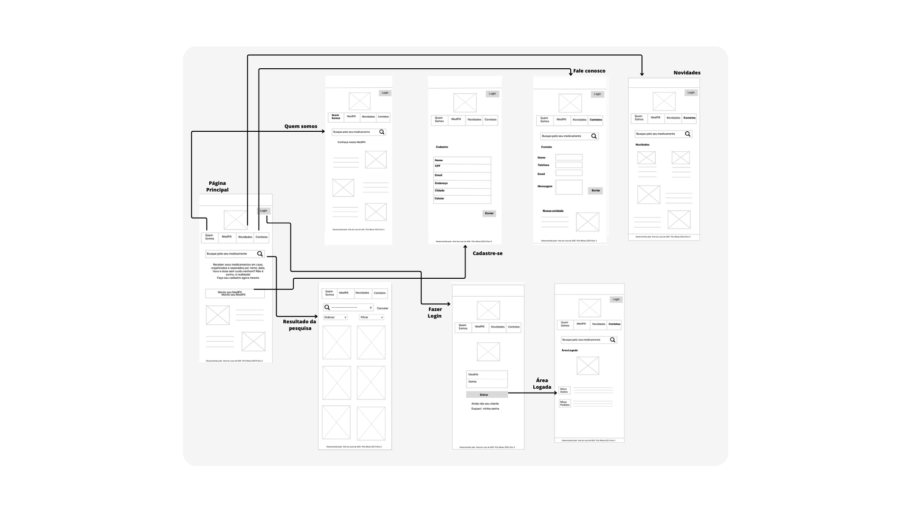
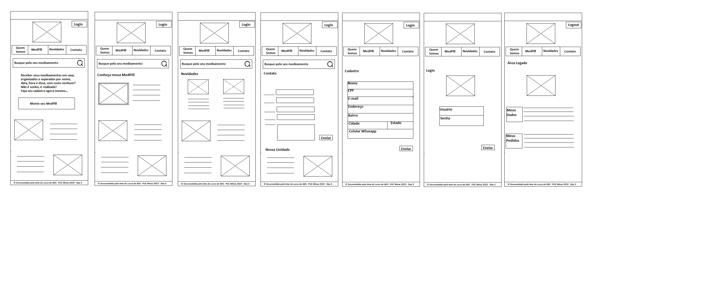

# Projeto de Interface

Pré-requisitos: <a href="2-Especificação do Projeto.md"> Documentação de Especificação</a>

Visão geral da interação do usuário pelas telas do sistema e protótipo interativo das telas com as funcionalidades que fazem parte do sistema (wireframes).

 Apresente as principais interfaces da plataforma. Discuta como ela foi elaborada de forma a atender os requisitos funcionais, não funcionais e histórias de usuário abordados nas <a href="2-Especificação do Projeto.md"> Documentação de Especificação</a>.

## Diagrama de Fluxo

  

## Wireframes

Os wireframes são protótipos das páginas que terão em nosso aplicativo, para ter uma idéia do que será desenvolvido e as relações entre as páginas, com essa visão ficará mais fácil a programação do nosso aplicativo ganhando tempo com o desenvolvimento. 

  
